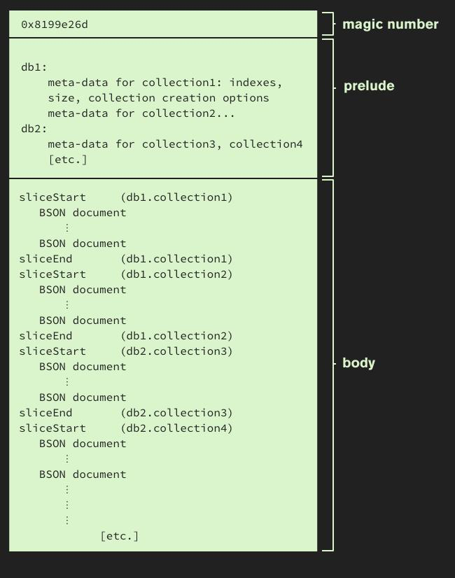
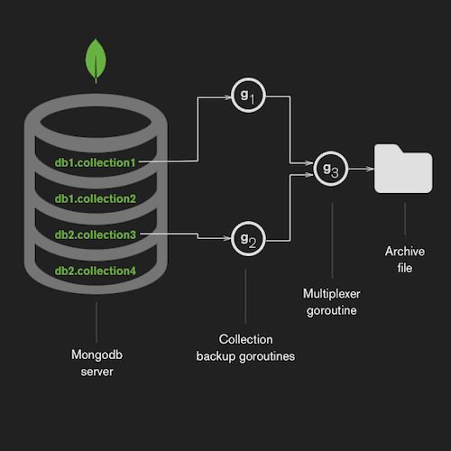

Project documentation

# IDE

## How to properly format Java code

The file  `./ide/code-formatter-settings.xml` can be used in Eclipse, IntelliJ or VSCode. It is based on the default Eclipse style but add some changes to properly format fluent API calls.

On VSCode use the following setting:

``` 
"java.format.settings.url": "./ide/code-formatter-settings.xml",
```

On Eclipse go in Preference → Java → Code Style → Formatter → import

On intelliJ go in *Settings* → *Code Style* → *Java*, click *Manage*, and import that XML file by simply clicking *Import*.

## Setup Lombok support

This project uses the [Project Lombok](https://projectlombok.org/) framework on top of SpringBoot. If you don't configure properly your IDE you will have tons of "not defined" errors.

- As far as I know there is no support for VSCode
- There is a plugin for Eclipse
- Intellij support it natively (see [that](https://projectlombok.org/setup/intellij)).

According to [this post](https://stackoverflow.com/a/46034044), you have to do this for Eclipse:


- Exit Eclipse(if it is open) and download the jar from [https://projectlombok.org/download](https://projectlombok.org/download)
- Execute command: `java -jar lombok.jar`
- This command will open window as shown [here](https://projectlombok.org/setup/eclipse), install and quit the installer.
- Add jar to build path/add it to pom.xml.
- Restart eclipse.
- Go to Eclipse --> About Eclipse --> check 'Lombok v1.16.18 "Dancing Elephant" is installed. https://projectlombok.org/'
- To enable Lombok for the project: **Enable annotation processing** in the project settings (Java compiler->Annotation processing). 

## Understand what Lombok does to your code

Lombok use annotations to inject getters and setters so you don't have to write them. It means that it is acting as a preprocessor and generate an alternate .java/class file that will be debugged and shipped. 

The way Lombok work can be questionable (more info [here](https://news.ycombinator.com/item?id=19048335)):

- Project Lombok hooks itself into the compilation process as an annotation processor. But Lombok is not your normal annotation processor... The trick is that Lombok modifies the AST. It turns out that changes made to the AST in the Annotation Processing phase will be visible to the Analyse and Generate phase. Thus, changing the AST will change the generated class file.
- Some people are uncomfortable with the extensive bytecode manipulation that it does. 

The drawback: 
- You are writing code that cannot be understood by any IDE without a plugin.
- Without a Lombok plugin, your IDE will complain that you didn't wrote the getters and setters.
- In case of incompatiblity or deprecation in future JDK, your entire code base will be broken.

# Environment variables and Debug

This project use Springboot annotation `@Value` which can read values from environments variables. This is especially useful in a Docker container.
In order to be able to debug under Eclipse you will have to set some environment variables:

- MAPPINGS: mappings location
- MONGO_DUMPFOLDER: where the dumps are
- SPRING_CLOUD_QUARTZ_ENABLED: false
- SPRING_CLOUD_VAULT_ENABLED: false
- SPRING_DATASOURCE_URL: jdbc:postgresql://localhost:5432/etl

then run a `maven spring-boot:run` in Debug.

Note: of course you need to run a Postgresql database somewhere

# About Mongodump

## Introduction

The tool **Mongodump** is used to save and restore various collections from a MongoDB database. It is highy optimized for speed so it is not a surpirse to see it is written in **golang**. 

- Mongodump can save data in "exploded" mode, which is not very convenient for backup: you have multiple folders and json/bson files
- Mongodump can save data in "archive" format. This is the one we want to parse.

## The archive format

The archive format have been introduced in [MongoDb 3.2]( https://docs.mongodb.com/manual/release-notes/3.2/#mongodb-tools-enhancements) to allow streamable backup and restore. The format is especially designed for streaming wheras formats like **tar** cannot be used for that.

Creating a dump is done like this:

```
mongodump --archive=test.20150715.archive --db=test
```

You can also compress it:

```
mongodump --archive=test.20150715.archive --db=test --gzip
```

Documentation about this format is hard to find. Here some links:

- [Mongodump's archiving mode principle analysis](https://www.programmersought.com/article/58931250564/)
- mongodump source code on [GitHub](https://github.com/mongodb/mongo-tools-common/tree/master/archive) (written in golang)
- [Archiving and Compression in MongoDB Tools](https://www.mongodb.com/blog/post/archiving-and-compression-in-mongodb-tools)

Here is the general structure of the dump:



Basically, it's just a magic number of 4 bytes followed by a bunch of BSON documents. The **prelude** can be parsed with predefined object, wheras the body depends completly of what is in the database.

The magic number is followed by a Header:

```java
@JsonIgnoreProperties(ignoreUnknown = true)
public class Header {
	@JsonProperty("concurrent_collections")
	public Long concurrentCollections;
	public String version;
	@JsonProperty("server_version")
	public String serverVersion;
	@JsonProperty("tool_version")
	public String toolVersion;
}
```

It is very important to let the parser ignore **unknown fields** for robustness:

```java
@JsonIgnoreProperties(ignoreUnknown = true)
```

Then come various informations for each collections. We load them in the following object:

```java
@JsonIgnoreProperties(ignoreUnknown = true)
public class MongoCollection {
	@JsonProperty("collection")
	public String name;
	@JsonProperty("db")
	public String database;
	public String metadata;
	public Long size;
}
```

Note 1: The field **metadata** is a string containing some json.

Note 2: The order of those records is random due to the way data are exported (see next chapter about slices)

## About slices

The archive format does not have a Slice section per say. It's just a way to explain that **collections are not dumped in one single contiguous BSON document**. They are sliced and multiplexed, due to the multithreaded algorythm exporting the data:



This is why when you read the dump, collections appear multiple times (in the **prelude** and in the **body**) in a random order.

- The format of a slice start always with the same record used in the prelude. So we can deserialize our class **MongoCollection**.

- Then comes what we are looking for: the data of the collection.

## About Bson documents

Because we need a json parser able to stream, we use the [Jackson API ](https://github.com/FasterXML/jackson).

We will parse the Bson with a plugin for the Jackson API called [bson4jackson](https://github.com/michel-kraemer/bson4jackson).

Each bson document start with a **size** record corresponding to the document size plus the record itself. Because of this, we must instruct the parser to honnor this record:

```java
BsonFactory jsonFactory = new BsonFactory();
		jsonFactory.enable(BsonParser.Feature.HONOR_DOCUMENT_LENGTH);
```

# How to parse gigabytes of gziped Bson

## JDK Streams

We use the input streams provided by the JDK. They are composable so we can do that:

```java
try (DataInputStream in = new DataInputStream(new GZIPInputStream(new FileInputStream(dumpFile)))) {
 // read the dump
}
```

- The **DataInputStream** allow us to read low level records like the magic number

- We can pass it to a Bson parser to consume a Bson object at any point in the stream

Since we have multiple Bson documents in a single stream, we will receive EOFException and this is perfectly normal.

Here how to read a single document:

```java
long recordCount = 0;
for (;;) {
  try {
    // READ BSON Document
    // Here we read as records as we can until EOF
    recordCount++;
  } catch (EOFException e) {
    break;
  }
}
```

## The end of the dump

At the end of the dump, the input stream have nothing to provide to the consumer. So the Bson API will raise an **IOException** exactly when it try to read the first bytes of a Bson document. This is of course, the expected behavior. 

Because of this, we consume the entire dump body like this:

```java
	private void readBody(BsonFactory jsonFactory, DataInputStream in) throws IOException {
		for (;;) {
			try {
				readSlice(jsonFactory, in);
			} catch (IOException e) {
				if (in.available() == 0) {
					break; // End of the entire dump
				} else {
					log.error("Unexpected error", e);
					break;
				}
			}
		}
	}
```


## Skip unused records

Since we consume a stream, **it is not allowed to "seek to skip"**, we must consume the current bson record. In order to do that as quickly as possible we just consume the following class:

```java
@JsonIgnoreProperties(ignoreUnknown = true)
public class GenericCollectionRecord {
}
```

## Consume relevant records

### Parser

Once we encounter a relevant record, we still don't know its structure. So we must use the low level parser API to read token by token the data and forge a data structure that is relevant for our job.

Typical tokens are: START_OBJECT,START_ARRAY,VALUE_STRING,VALUE_NUMBER_INT,VALUE_TRUE,VALUE_FALSE,END_OBJECT,END_ARRAY... 

The job of the class **FlatBsonDecoder** is to receive the stream of tokens and produce a hashmap representing the current record. This map will be used as input for the export to PostgreSQL.

### About ObjectId format

ObjectId is a 12-byte representation of a unique identifier for a record. Nevertheless, there is a subtility around those 12 bytes:

- Old ObjectId are composed by 3 values: **time**, **machine** and **inc**
- New ObjectId are composed by 4 values: **time**, **machine**, **processId** and **inc**

Those two formats are exchangeable. The 12-byte representation will be round-trippable from old to new driver releases.

The Jackson API rely on the old format so we need to convert to the new format at some point with the following code:

```java
ObjectId oid = (ObjectId) obj; // The Jackson ObjectId class
org.bson.types.ObjectId mongoObjectId = org.bson.types.ObjectId.createFromLegacyFormat(oid.getTime(),
						oid.getMachine(), oid.getInc());
```

# About this project

## History

This is a fork from the project [mongo-postgresql-streamer](https://github.com/Maltcommunity/mongo-postgresql-streamer).

- Initialy the project was intented to read directly from a MongoDB database
- We extended it to take multiple MongoDB dumps instead.

The project use Lombok which is unfortunate. We may remove it at some point.

